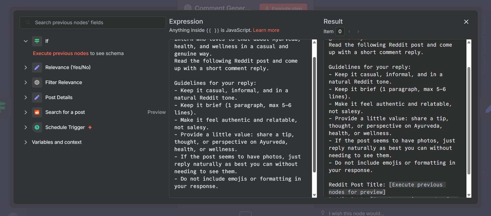
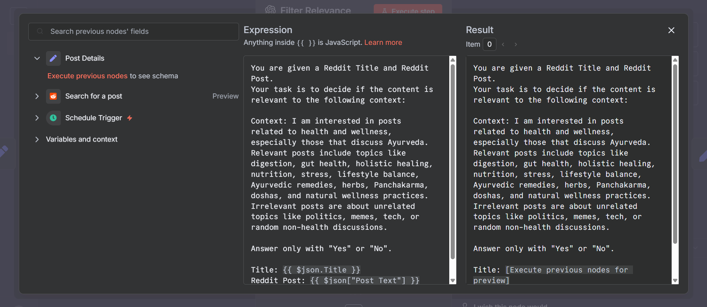
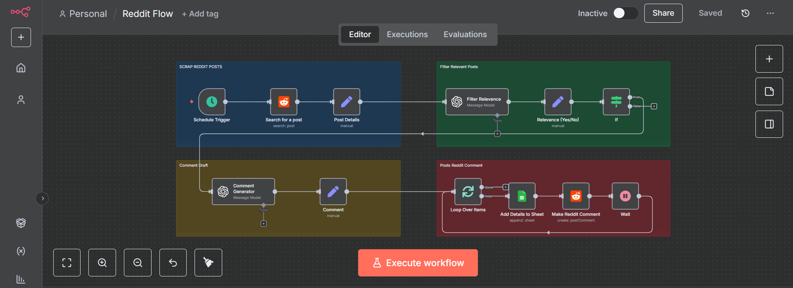

# 🤖 Reddit-Auto-Comment Workflow

Automate engaging with Reddit posts in **health, wellness, and Ayurveda communities**! 🌿💪 This workflow finds relevant posts, generates context-aware replies, stores data, and comments safely while respecting Reddit’s policies.

---

## ✨ Features

- 🔍 **Extract posts** from targeted subreddits or by keyword search  
- 🧹 **Filter posts** for relevance to your health/wellness context  
- 🤖 **LLM-powered relevance check** for precision  
- ✍️ **Generate natural, casual comments** tailored to each post  
- 🗂 **Log all posts and comments** in Google Sheets  
- ⏱ **Safe commenting** with 11-minute intervals to avoid bans  

---

## 🛠 Workflow Steps

### 1️⃣ Extract Reddit Posts
- Use **Reddit → Get Many Posts** node.  
- Target subreddits: `r/Ayurveda`, `r/Nutrition`, `r/HealthyLifestyle`.  
- Use keyword queries: `ayurveda`, `digestion`, `mental clarity`.  

---

### 2️⃣ Filter by Keyword Match
- Use an **IF** node to drop irrelevant posts quickly.  
- Keywords: `ayurveda`, `digestion`, `healing`, `balance`, `nature`.  

### 3️⃣ Relevance Check with LLM
- Send the post title and text to an LLM node (e.g., OpenAI).  
- **Prompt example:**
- 
My context: I’m interested in health and wellness discussions, especially Ayurveda, digestion, or natural living.
Reddit Post Title: {{ $json.title }}
Reddit Post Text: {{ $json.selftext }}
Is this relevant to my context? Reply Yes or No only.

- Keep posts with "Yes" responses only.  

**Screenshot:**  

---

### 4️⃣ Generate Contextual Comments
- Use an LLM node to craft **fun, casual comments**.  
- **Prompt example:**  

You are a fun and friendly marketing intern. Reply casually in 5–6 lines max, referencing Ayurveda, health, or wellness.
Keep it authentic, brief, and informal without emojis.

Reddit Post Title: {{ $json.title }}
Reddit Post Text: {{ $json.selftext }}

**Screenshot:**  

---

### 5️⃣ Store Data in Google Sheets
- Log post title, subreddit, post text, generated comment, and status.  
- Helps track workflow history and avoid duplicates.  

### 6️⃣ Comment on Reddit
- Use **Reddit → Create a comment in a post** node.  
- Pass the post ID in **t3_<postId>** format.  
- Use generated comment text.  

### 7️⃣ Delay Between Comments
- Insert a **Wait node** with **11-minute delay** between comments. ⏳  
- Reduces risk of spam detection and ensures compliance with Reddit policies.  

---

## ⚠️ Notes & Best Practices

- ✅ Use a dedicated Reddit account for automation.  
- ✅ Test in smaller subreddits before scaling.  
- ✅ Keep responses **authentic and non-promotional**.  
- ✅ Respect subreddit rules and Reddit API limits.  
- ⚠️ Avoid commenting too fast; use delays to stay safe.  

---

## 📦 Requirements

- n8n self-hosted or cloud  
- Reddit API credentials (OAuth2)  
- Google Sheets API credentials  
- OpenAI or other LLM provider  

---

## 📸 Workflow Overview

This shows the full Reddit Auto-Comment workflow from **post extraction → filtering → LLM comment generation → posting → logging**.

---

## 📝 License

This project is open-source. Feel free to modify and extend the workflow!  

